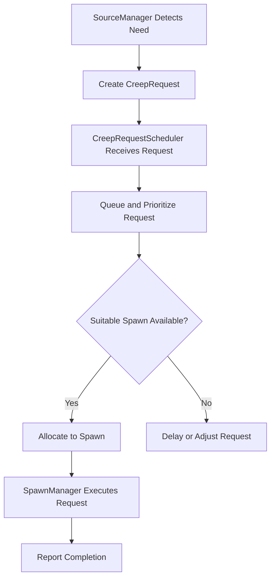
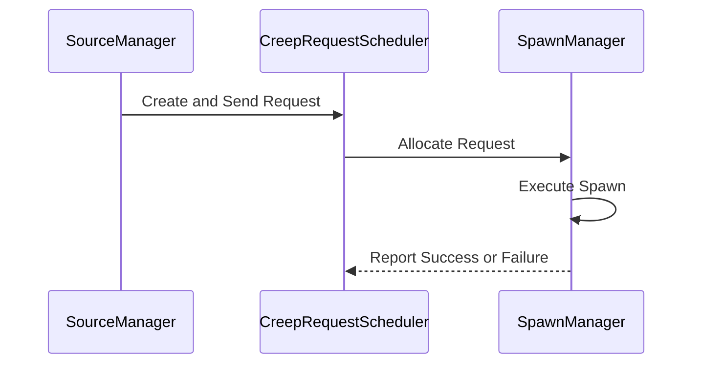
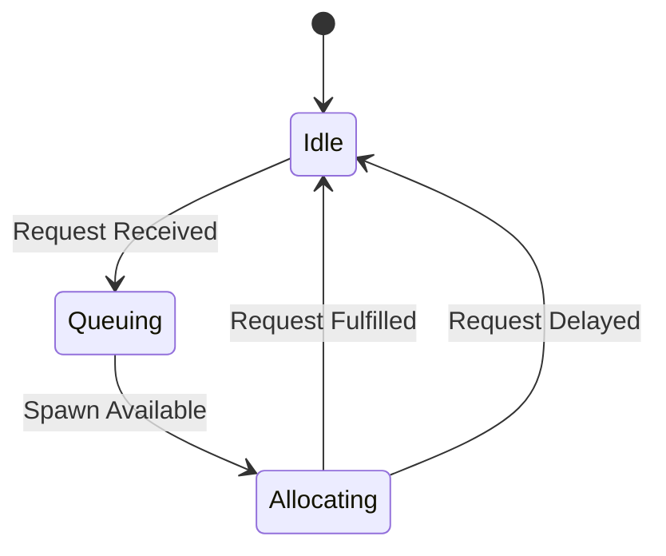

# Creep Request Architecture for Screeps

## Overview

This section outlines the architecture for a request-driven system to manage creep spawning in Screeps. It focuses on decoupling the high-level logic of managing colony needs from the execution of spawning creeps. The primary components are the `SourceManager`, `CreepRequestScheduler`, and `SpawnManager`.

## Components

### 1. **SourceManager**

- **Responsibilities**:

  - Calculates the need for new creeps based on resource levels, tasks, and game state.
  - Generates `CreepRequest` objects, which encapsulate the specifications for required creeps.

- **Outputs**:

  - `CreepRequest` objects sent to the `CreepRequestScheduler`.

- **Example Process**:

  1. Detects insufficient harvesters to maintain energy production.
  2. Creates a `CreepRequest` with the role `harvester`, priority `high`, and specifications `{ parts: [WORK, CARRY, MOVE], energyCost: 200 }`.
  3. Sends the request to the `CreepRequestScheduler`.

### 2. **CreepRequestScheduler**

- **Responsibilities**:

  - Manages a centralized queue of `CreepRequest` objects.
  - Prioritizes requests based on urgency and available resources.
  - Allocates requests to the most suitable spawn, considering energy capacity, queue length, and proximity.

- **Features**:

  - **Queueing and Prioritization**:
    - Requests are queued and sorted by priority, with optional fast-tracking for critical needs.
  - **Spawn Allocation**:
    - Evaluates all spawns to select the optimal one for fulfilling the request.
    - Handles edge cases where no spawns are available in the same room.
  - **Fallbacks**:
    - If no suitable spawn is available, delays or downsizes the request.

- **Example Process**:

  1. Receives a `CreepRequest` for a `harvester` from `SourceManager`.
  2. Evaluates all spawns for suitability based on energy, queue, and distance.
  3. Assigns the request to the most appropriate spawn.
  4. Notifies the `SpawnManager` to proceed with spawning.

### 3. **SpawnManager**

- **Responsibilities**:

  - Executes the spawning process for assigned `CreepRequest` objects.
  - Monitors spawn queues and energy levels.
  - Reports completion or failure back to the `CreepRequestScheduler`.

- **Features**:

  - Manages multiple spawns in a single room or across rooms.
  - Optimizes spawn operations to reduce idle time.

- **Example Process**:

  1. Receives a `CreepRequest` from the `CreepRequestScheduler`.
  2. Verifies sufficient energy is available and the spawn is idle or minimally queued.
  3. Initiates the spawning process.
  4. Reports success or delay to the `CreepRequestScheduler`.

## Interactions

### Request Flow

1. `SourceManager` detects a need for a new creep and creates a `CreepRequest`.
2. The `CreepRequestScheduler` receives the request, queues it, and evaluates spawns.
3. The `CreepRequestScheduler` allocates the request to an optimal spawn and notifies the `SpawnManager`.
4. The `SpawnManager` executes the request and updates the scheduler upon completion.

### Error Handling

- If a spawn cannot fulfill the request (e.g., insufficient energy), the scheduler:
  - Delays the request.
  - Adjusts the request (e.g., reduces body parts).
  - Searches for alternative spawns in other rooms.

## Diagrams

### Flowchart: Creep Request Lifecycle



### Sequence Diagram: Creep Request Fulfillment



### State Diagram: CreepRequestScheduler



## Implementation Notes

### CreepRequest Structure

```javascript
class CreepRequest {
    constructor(role, priority, specifications) {
        this.role = role;
        this.priority = priority;
        this.specifications = specifications; // e.g., { parts: [WORK, CARRY, MOVE], energyCost: 200 }
    }
}
```

### Scheduler API

- **enqueueRequest(request: CreepRequest): void**
  - Adds a new request to the queue.
- **allocateRequest(): void**
  - Finds the most suitable spawn for the highest-priority request.
- **handleFailure(request: CreepRequest): void**
  - Adjusts or delays the request if no spawn can fulfill it.

---

This architecture lays the groundwork for a robust, scalable system to manage creep spawning efficiently in Screeps. The next step is to refine and implement the `CreepRequestScheduler` while ensuring smooth integration with existing components.

