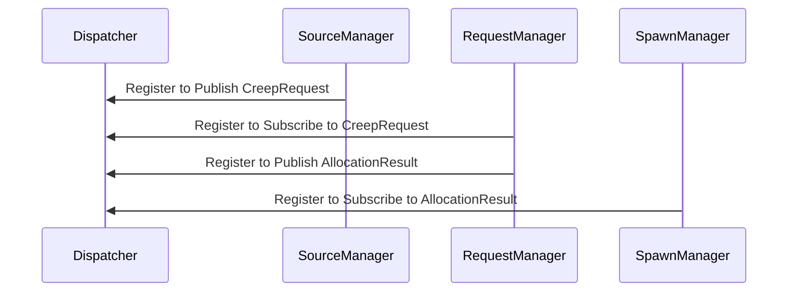
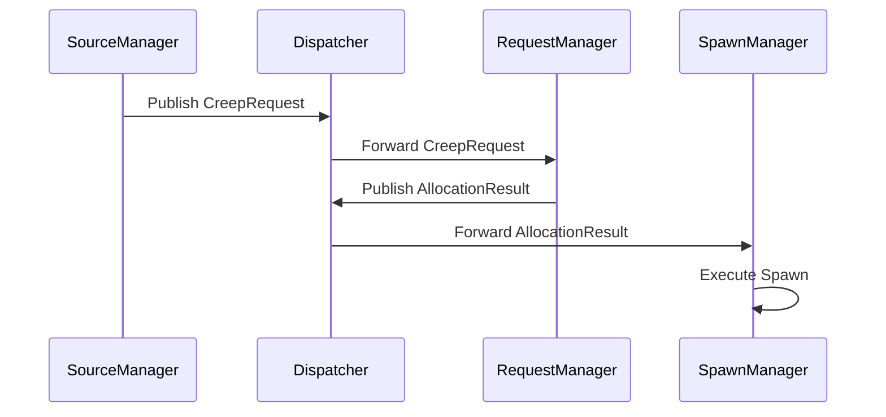
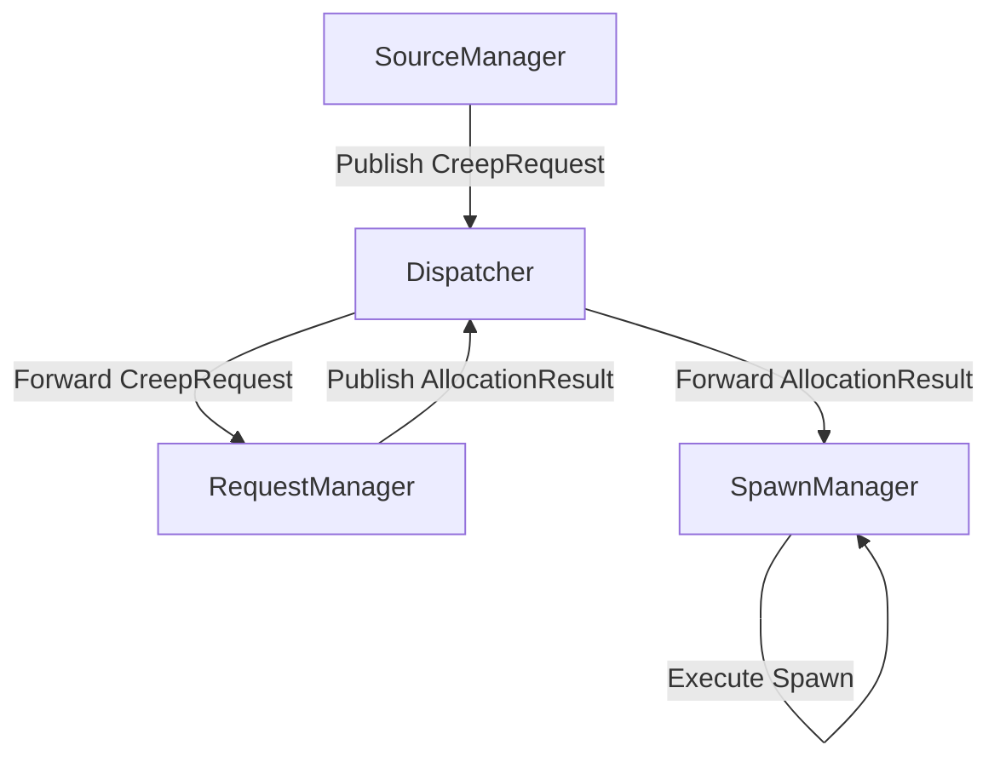

# Dispatcher Message Flow Example

## Overview
This example illustrates how the `EntityMessageBus` with a `Dispatcher` facilitates communication between three key entities in the redesigned architecture: `SourceManager`, `RequestManager`, and `SpawnManager`. The focus is on transparency, schema validation, and data flow through the system.

---

## **Entities Involved**

1. **SourceManager**:
   - Publishes `CreepRequest` messages based on its energy supply and available work slots.
   - Schema:
     ```json
     {
       "role": "string",
       "priority": "string",
       "specifications": null,
       "constraints": {
         "sourceRoom": "string"
       }
     }
     ```

2. **RequestManager**:
   - Subscribes to `CreepRequest` messages.
   - Validates and prioritizes incoming requests.
   - Publishes `AllocationResult` messages after assigning spawns.
   - Schema for `AllocationResult`:
     ```json
     {
       "spawn": "string",
       "request": {
         "role": "string",
         "priority": "string",
         "specifications": {
           "parts": "array",
           "energyCost": "number"
         },
         "constraints": {
           "sourceRoom": "string"
         }
       }
     }
     ```

3. **SpawnManager**:
   - Subscribes to `AllocationResult` messages.
   - Executes creep creation based on the assigned request.

---

## **Workflow**

### **Entity Registration**


1. **SourceManager**:
   - Registers with the dispatcher to publish `CreepRequest` messages.

2. **RequestManager**:
   - Registers to subscribe to `CreepRequest` messages and publish `AllocationResult` messages.

3. **SpawnManager**:
   - Registers to subscribe to `AllocationResult` messages.

---

### **Message Publishing and Handling**


1. **SourceManager**:
   - Publishes a `CreepRequest` message to the dispatcher:
     ```javascript
     dispatcher.publish('CreepRequest', {
         role: 'mule',
         priority: 'high',
         specifications: null, // No parts specified at this stage
         constraints: { sourceRoom: 'W1N1' }
     });
     ```

2. **RequestManager**:
   - Subscribes to `CreepRequest` messages.
   - Validates and processes the message, prioritizing it in the queue.
   - Publishes an `AllocationResult`:
     ```javascript
     dispatcher.publish('AllocationResult', {
         spawn: 'Spawn1',
         request: {
             role: 'mule',
             priority: 'high',
             specifications: { parts: [CARRY, MOVE], energyCost: 100 },
             constraints: { sourceRoom: 'W1N1' }
         }
     });
     ```

3. **SpawnManager**:
   - Subscribes to `AllocationResult` messages.
   - Executes the spawning process using the game API (e.g., `spawn.spawnCreep`).

---

## **Error Handling**

1. **Invalid Schema**:
   - Dispatcher validates payloads against schemas before forwarding messages.
   - If invalid, logs an error and discards the message:
     ```plaintext
     Error: Invalid payload for CreepRequest
     Received: { ... }
     Expected: { role: 'string', ... }
     ```

2. **Resource Conflicts**:
   - If no spawn can fulfill the request, `RequestManager` retries or adjusts the request (e.g., reducing energyCost).

3. **Spawn Failures**:
   - If spawning fails (e.g., insufficient energy), `SpawnManager` publishes a failure message back to the dispatcher.

---

### **Diagram: Full Data Flow**


---

## Key Features
- **Transparency**:
  - Defined schemas ensure all entities understand the message format.
  - Centralized dispatcher logs and routes messages.

- **Extensibility**:
  - New entities can register with the dispatcher without modifying existing code.

- **Decoupling**:
  - Entities only interact via messages, reducing direct dependencies.

---

This example showcases how the `EntityMessageBus` and dispatcher work together to orchestrate creep spawning while maintaining flexibility and robustness.

