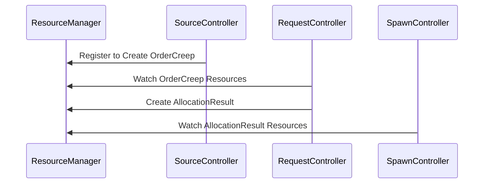
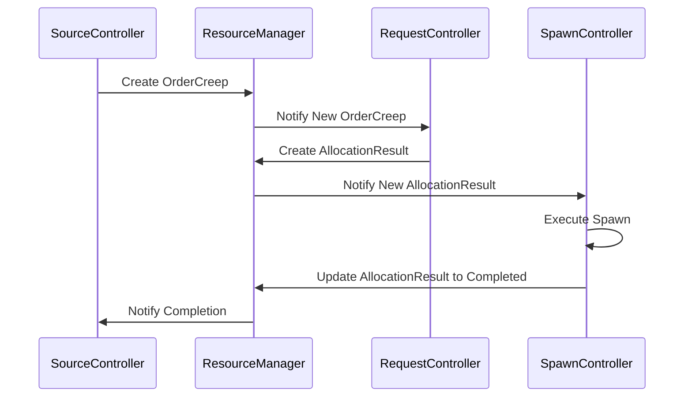
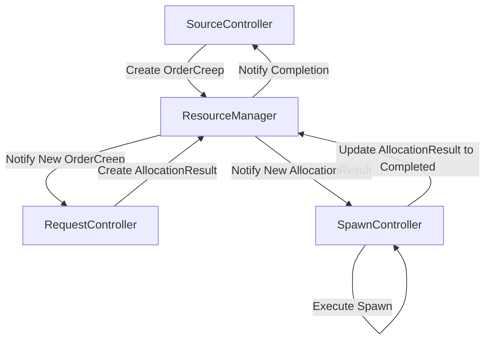

# Dispatcher Message Flow Example

## Overview
This example illustrates how the `ResourceManager` facilitates communication between three key controllers in the redesigned architecture: `SourceController`, `RequestController`, and `SpawnController`. The focus is on transparency, schema validation, and data flow through the system.

---

## **Entities Involved**

1. **ResourceManager**:
   - Acts as the central authority for managing resources.
   - Provides APIs for creating, updating, and querying resources.
   - Ensures consistent state and validation across all controllers.

2. **SourceController**:
   - Publishes `OrderCreep` resources based on its energy supply and available work slots.
   - Tracks active resources in a lightweight view stored in memory (`activeOrders`).
   - On receiving an `AllocationResult`, marks the corresponding `OrderCreep` as completed and publishes an `InvalidateRoutes` resource.
   - Schema for `OrderCreep`:
     ```json
     {
       "id": "string",
       "type": "OrderCreep",
       "role": "string",
       "priority": "string",
       "specifications": null,
       "constraints": {
         "sourceRoom": "string"
       }
     }
     ```

3. **RequestController**:
   - Watches `OrderCreep` resources managed by the `ResourceManager`.
   - Validates and prioritizes incoming requests.
   - Manages resource routing by assigning `OrderCreep` resources to spawns.
   - Creates `AllocationResult` resources after assigning spawns.
   - Schema for `AllocationResult`:
     ```json
     {
       "id": "string",
       "type": "AllocationResult",
       "spawn": "string",
       "orderId": "string",
       "state": "string"
     }
     ```

4. **SpawnController**:
   - Watches `AllocationResult` resources managed by the `ResourceManager`.
   - Executes creep creation based on the assigned `OrderCreep`.
   - Updates the `AllocationResult` resource state to `completed` once spawning is done.

---

## **Workflow**

### **Entity Registration**


1. **ResourceManager**:
   - Manages all resources (`OrderCreep`, `AllocationResult`).

2. **SourceController**:
   - Registers with the `ResourceManager` to create `OrderCreep` resources.

3. **RequestController**:
   - Watches for new `OrderCreep` resources and creates `AllocationResult` resources.

4. **SpawnController**:
   - Watches for `AllocationResult` resources and executes creeps.

---

### **Message Publishing and Handling**


1. **SourceController**:
   - Creates an `OrderCreep` resource:
     ```javascript
     const orderId = resourceManager.applyResource('OrderCreep', {
         role: 'harvester',
         priority: 'high',
         specifications: null, // No parts specified at this stage
         constraints: { sourceRoom: 'W1N1' }
     });
     ```

2. **RequestController**:
   - Watches for `OrderCreep` resources.
   - Allocates the order to a spawn and creates an `AllocationResult` resource:
     ```javascript
     resourceManager.applyResource('AllocationResult', {
         spawn: 'Spawn1',
         orderId,
         state: 'allocated'
     });
     ```

3. **SpawnController**:
   - Watches for `AllocationResult` resources.
   - Executes the spawn process and marks the `AllocationResult` as `completed`:
     ```javascript
     resourceManager.updateResource(allocationId, { state: 'completed' });
     ```

4. **Completion Notification**:
   - The `ResourceManager` notifies the `SourceController` of the `OrderCreep` completion.

---

### **Diagram: Full Data Flow**


---

## Key Features

1. **Centralized Resource Management**:
   - `ResourceManager` acts as the central authority for managing resources, ensuring consistent state across entities.

2. **Decoupled Controllers**:
   - `SourceController` focuses on creating and tracking `OrderCreep` resources.
   - `RequestController` handles routing and allocation.
   - `SpawnController` handles execution and completion updates.

3. **Separation of Concerns**:
   - Each controller is responsible for its domain-specific tasks, reducing coupling and improving scalability.

