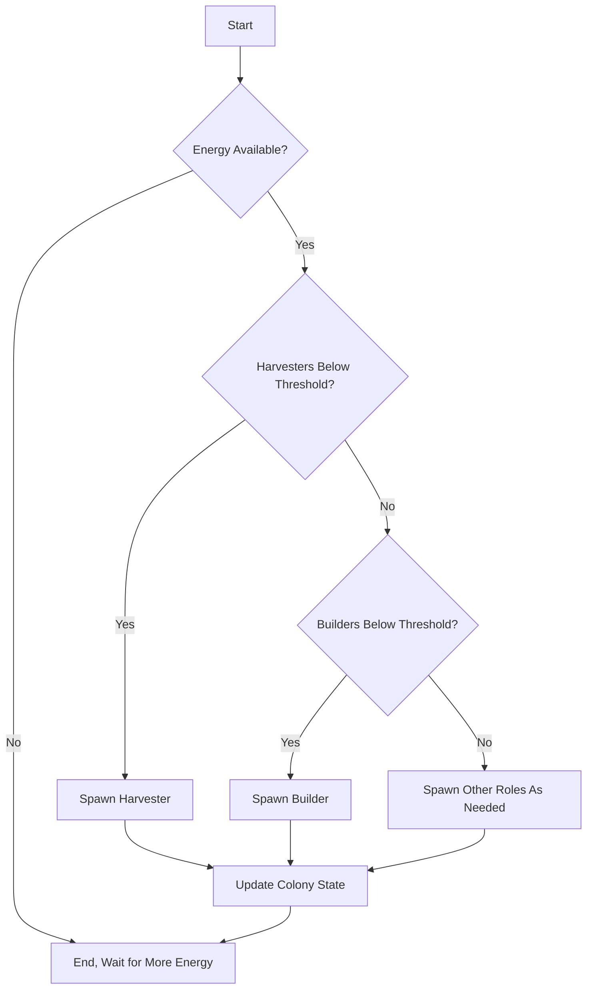
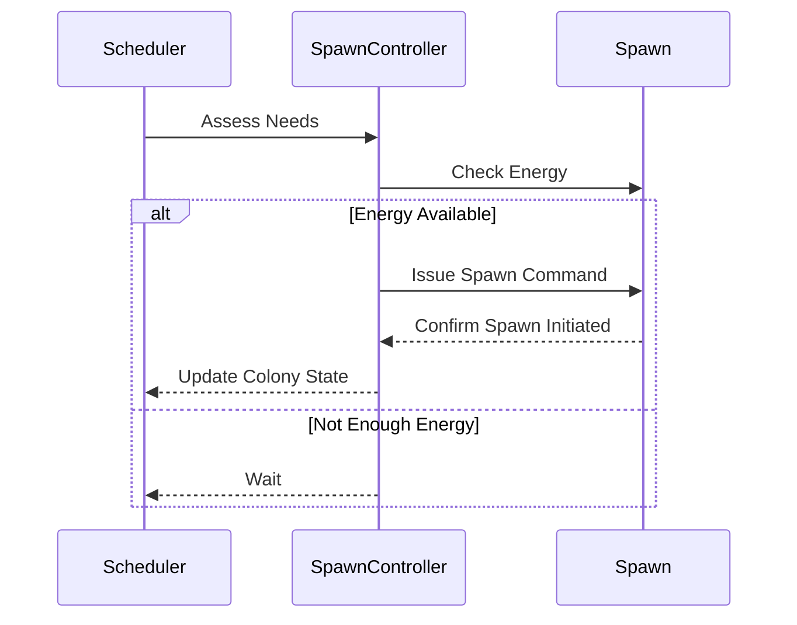

```mermaid
flowchart TD
    A[Start] --> B{Energy Available?}
    B -- Yes --> C{Harvesters Below Threshold?}
    B -- No --> Z[End, Wait for More Energy]
    C -- Yes --> D[Spawn Harvester]
    C -- No --> E{Builders Below Threshold?}
    E -- Yes --> F[Spawn Builder]
    E -- No --> G[Spawn Other Roles As Needed]
    D --> H[Update Colony State]
    F --> H
    G --> H
    H --> Z
```

```mermaid
sequenceDiagram
    participant Scheduler as Scheduler
    participant SpawnController as SpawnController
    participant Spawn as Spawn

    Scheduler->>SpawnController: Assess Needs
    SpawnController->>Spawn: Check Energy
    alt Energy Available
        SpawnController->>Spawn: Issue Spawn Command
        Spawn-->>SpawnController: Confirm Spawn Initiated
        SpawnController-->>Scheduler: Update Colony State
    else Not Enough Energy
        SpawnController-->>Scheduler: Wait
    end
```