# Screeps Bot Architecture

## Table of Contents
- [Resource Management System](#resource-management-system)
  - [Source Management System](#source-management-system)
  - [Resource Lifecycles](#resource-lifecycles)
  - [Priority System Design](#priority-system-design)
  - [Memory Persistence](#memory-persistence)
- [Resource Transportation Design](#resource-transportation-design)
  - [Mule Role Architecture](#mule-role-architecture)
  - [Task Template System](#task-template-system)
- [Room Management System](#room-management-system)
  - [Integration with Resource Management](#integration-with-resource-management)
- [Creep Role System](#creep-role-system)
  - [Role Registry](#role-registry)
  - [Error Handling](#error-handling)
- [State Management and Initialization](#state-management-and-initialization)

## Resource Management System

The **Resource Management System** is the backbone of the bot’s operations. It manages:
- Game resources (e.g., sources, creeps)  
- Creep orders (creation, lifecycle states, priorities)  
- Spawn processes and memory persistence  

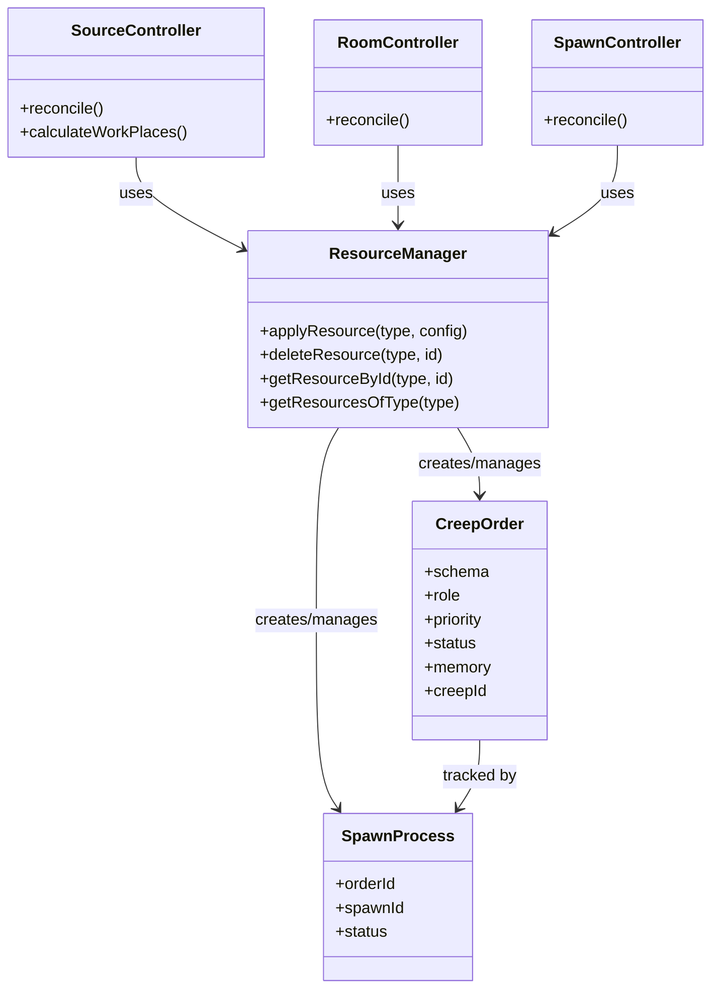

Key components:
1. **ResourceManager** – Central system for creating and managing resource records (e.g., `CreepOrder`, `SpawnProcess`).  
2. **SourceController**, **RoomController**, **SpawnController** – Specialized controllers that manage specific game aspects by interacting with the `ResourceManager`.  
3. **CreepOrder**, **SpawnProcess** – Resource types used for creep/harvester ordering and spawn workflow tracking.

### Source Management System

The **Source Management System** handles energy sources and ensures harvesters are spawned and assigned.  

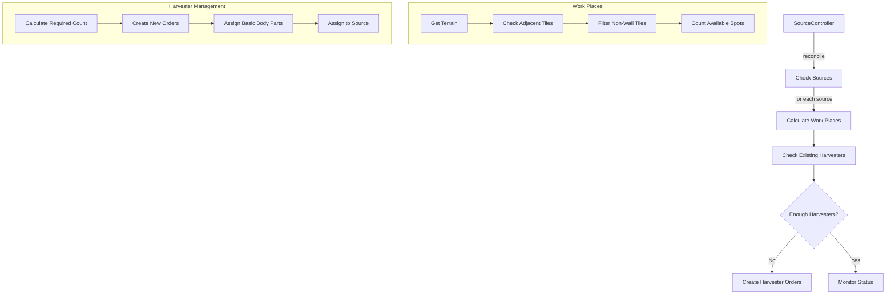

- **Work Place Calculation**: Identifies non-wall terrain around sources to determine maximum harvesters.  
- **Harvester Management**: Ensures each source has an optimal number of harvesters. Creates or adjusts `CreepOrder` records as needed.  
- **Resource Integration**: Relies on `ResourceManager` for tracking creeps and linking them to specific sources.

### Resource Lifecycles

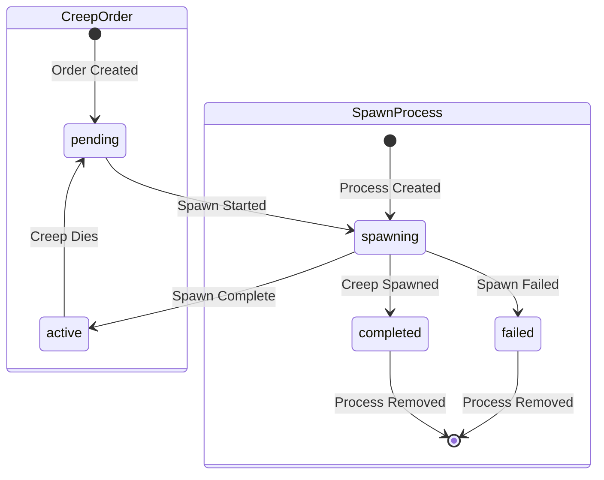

- **CreepOrder** represents persistent creep needs. When a creep dies, the order reverts to pending for respawn.  
- **SpawnProcess** tracks a spawn event, removed upon success or failure.  

### Priority System Design

To ensure consistent ordering and spawning:

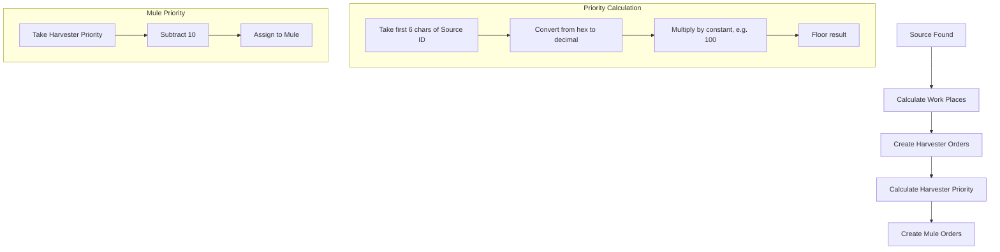

- **Harvester Priority** = `floor(parseInt(sourceId.substring(0, 6), 16) * 100)`  
- **Mule Priority** = `(Harvester Priority) - 10`  

This deterministic system assigns unique priorities per source, ensuring harvesters spawn before mules, while preserving stable ordering across ticks.

### Memory Persistence

All creep orders are stored in `Memory`, retaining:
- Priority  
- Source assignment  
- Any other config data (role, tasks, etc.)  

This data is maintained across game resets, ensuring stable or re-initialized states when VMs or the script environment restarts.

## Resource Transportation Design

### Mule Role Architecture

The **Mule Role** uses a simple state machine for resource transport:

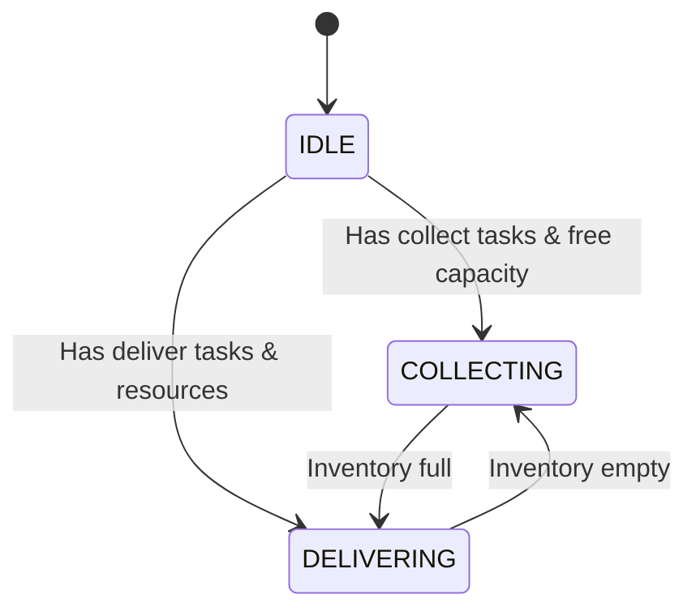

1. **IDLE**: No immediate tasks or waiting for next assignment.  
2. **COLLECTING**: Gathering resources until capacity is reached.  
3. **DELIVERING**: Delivering resources to designated targets (spawn, controller, or storage).

### Task Template System

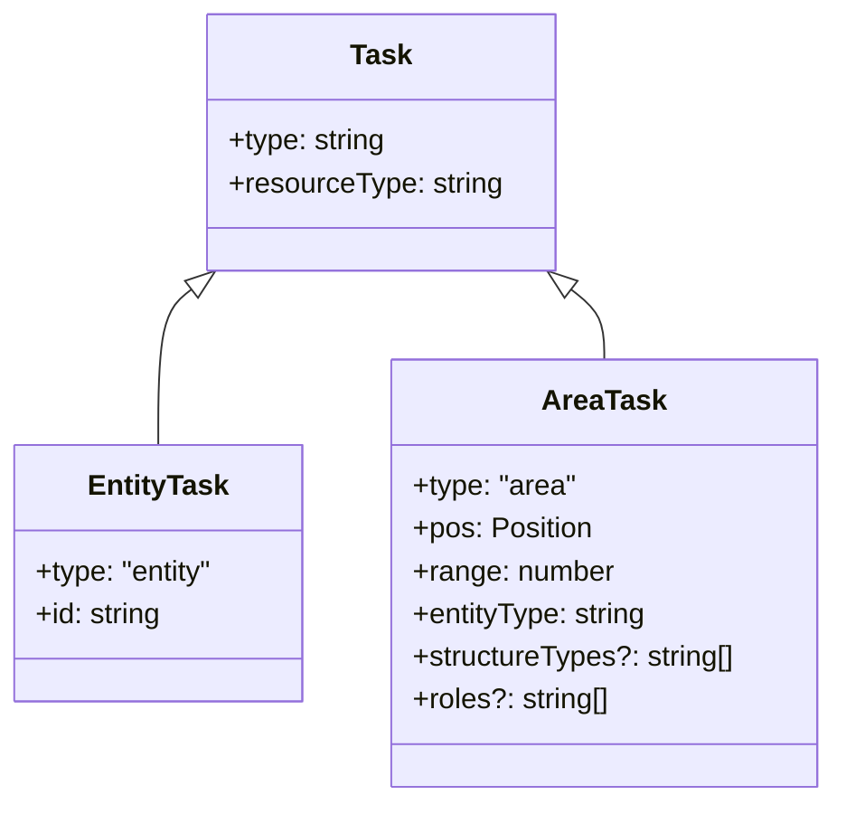

- **EntityTask**: Interact with a specific game object.  
- **AreaTask**: Search an area within a given range for valid objects.  

This flexible system allows the Mule to adapt to various collection/delivery scenarios.

---

## Room Management System

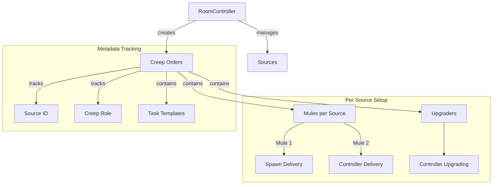

1. **RoomController** orchestrates each room, ensuring each source has enough creeps:
   - Typically, 1 or more Mules per source (spawn tasks, controller tasks, etc.)  
   - Upgrader creeps for controller upgrades.  
2. **Metadata Tracking** ties each creep order to its source and desired tasks.

### Integration with Resource Management

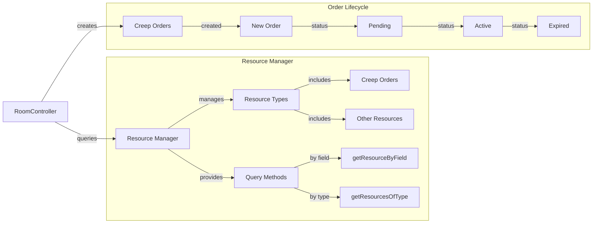

- **RoomController** uses `ResourceManager` to lookup or create orders.  
- **Order Lifecycle** from creation to either success or renewal if creeps die.  

This ensures:
- Consistent resource distribution.  
- Persistent assignments and tasks.  
- Clear role separation and maintenance of creep statuses.

---

## Creep Role System

The **Creep Role System** provides the logic for each creep type, managed by a central registry.

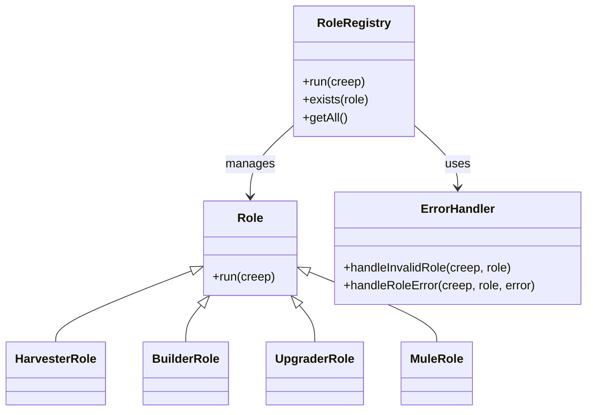

### Role Registry
1. Maintains a collection of implementations (Harvester, Mule, etc.).  
2. Provides a `run(creep)` interface to execute the appropriate role logic.  
3. Offers validation and utility methods.  

### Error Handling
1. Detects and logs invalid roles.  
2. Catches runtime errors, logs details for debugging.  
3. Prevents game loop crashes by isolating role logic from system-critical code.

---

## State Management and Initialization

A robust initialization ensures the bot can recover from resets and maintain stable operation:

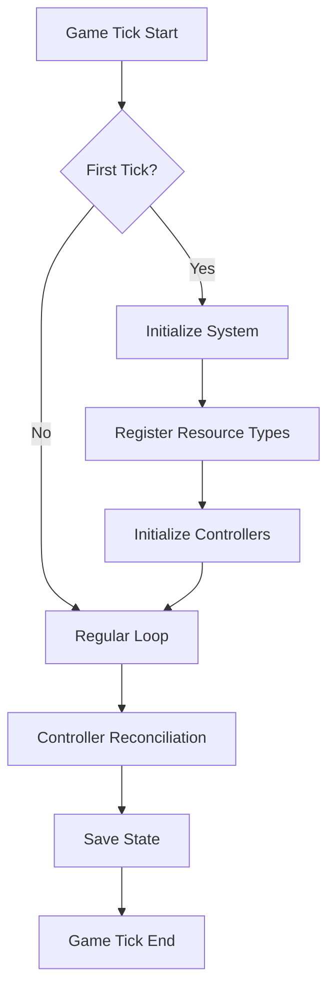

1. **Initialization Detection** – A module flag indicating if the system has been set up this session.  
2. **Controller Pattern** – Controllers (`SourceController`, `RoomController`, etc.) each handle reconciliation logic.  
3. **State Recovery** – Missing resources are recreated if they’re expected (e.g., sources).  
4. **Error Handling** – If errors are unrecoverable, a re-init can be forced on the next tick.

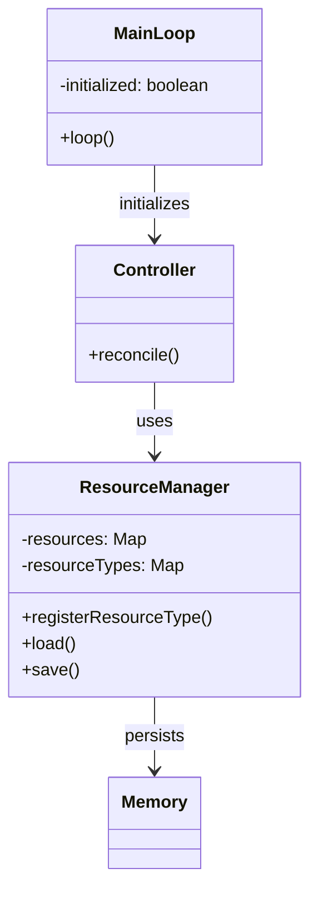

This system guarantees:
- One-time resource registration each session.  
- Automatic re-init if the VM resets.  
- Consistent, robust state across game ticks.
